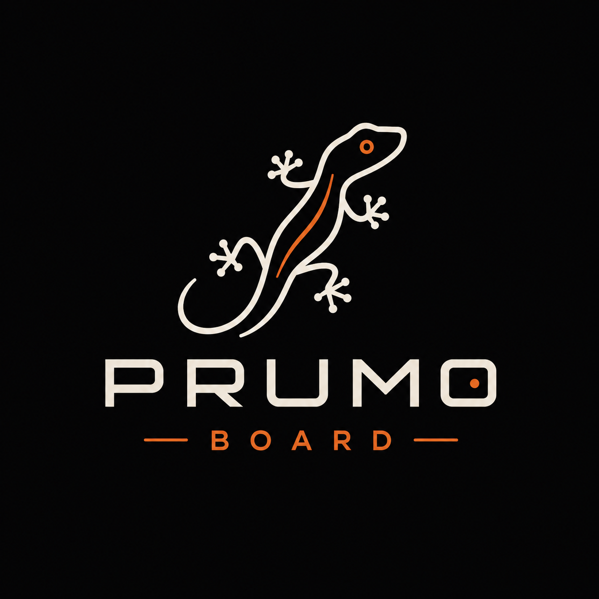

   

    

Prumo Board is an open hardware platform designed for education, research, and experimentation in embedded systems, wireless protocols, and applied electronics. Built around the ESP32-S3, it combines Sub-GHz communication, NFC/RFID, infrared, Wi-Fi, and Bluetooth capabilities into a single modular and portable device. The project aims to provide an accessible tool for students, makers, researchers, and developers who want to better understand how communication technologies work in practice while encouraging learning, rapid prototyping, and custom application development.

### The project aims to integrate various modules and provide reference code for using them in parallel, with the long-term goal of producing a final PCB, although for now, the project focuses on implementing this modular setup using perfboard.

## Current Hardware

| Component | Model | Purpose |
|-----------|---------|---------|
| Microcontroller | ESP32-S3 N16R8 | Main processing, Wi-Fi and Bluetooth |
| Display | ST7789 IPS 1.3" 240x240 SPI | Graphical user interface |
| Sub-GHz Radio | CC1101 433 MHz | Sub-GHz communication and signal analysis |
| 2.4 GHz Radio | NRF24L01+ with antenna | 2.4 GHz wireless communication |
| NFC/RFID | PN532 | NFC/RFID tag reading and writing |
| Infrared RX | KY-022 | Infrared signal reception |
| Infrared TX | KY-005 | Infrared signal transmission |
| Storage | MicroSD Module | File and data storage |
| Navigation | 6x6 mm tactile buttons | User interface control |
| Structure | FR4 perfboard 7x9 cm | Modular prototype platform |
| Assembly | M3 nylon standoffs | Module mounting and stacking |

## License

The Prumo Board Project is open source software licensed under the [MIT license](https://github.com/WalderlanSena/prumoboard/blob/main/LICENSE).

